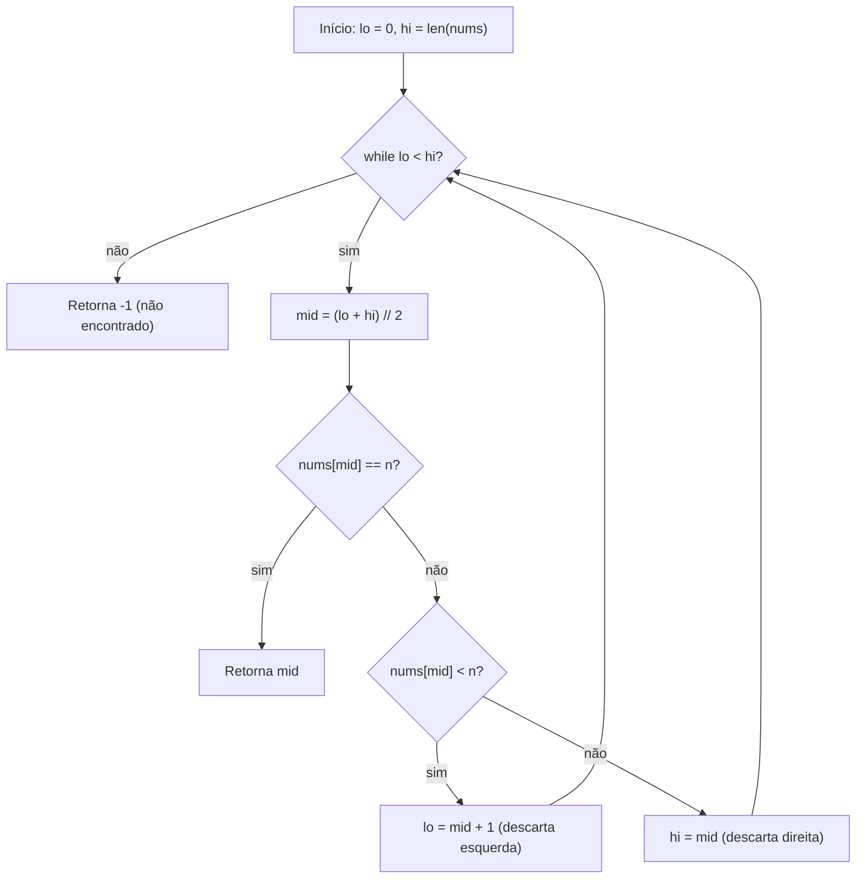
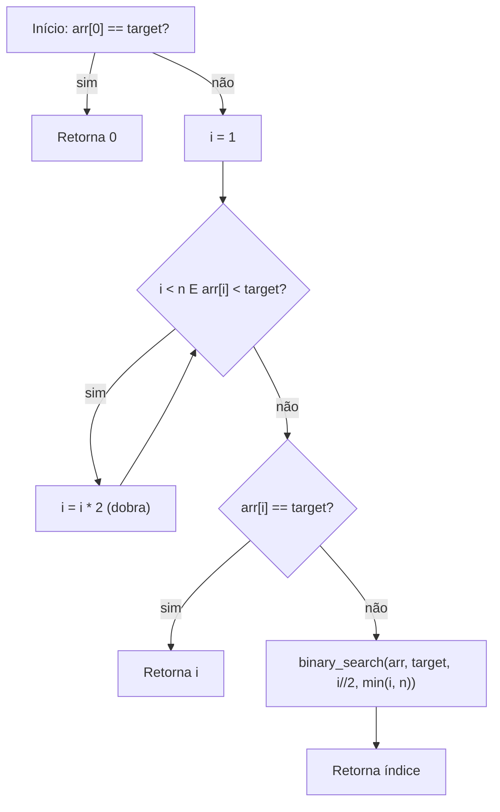

# Explicação — Arrays

Esta pasta contém dois algoritmos de **busca em arrays ordenados**:

- `binary_search.py` — busca binária
- `exponential_search.py` — busca exponencial

Ambos resolvem o mesmo problema (achar um elemento em um array ordenado), mas com estratégias diferentes. Vamos entender cada um.

---

## Busca Binária — `binary_search.py`

### O que é

A busca binária é o jeito mais eficiente de procurar um valor em um **array já ordenado**.

A ideia é parecida com procurar uma palavra no dicionário: você não lê palavra por palavra — abre no meio, vê se o que procura vem antes ou depois, e **descarta metade do dicionário a cada passo**.

No array, isso significa:

1. Olhe o elemento do **meio** (`mid`).
2. Se ele for o alvo, achou.
3. Se o alvo for **menor**, descarte a metade da direita.
4. Se o alvo for **maior**, descarte a metade da esquerda.
5. Repita até sobrar 0 elementos (não achou → retorna `-1`).

A cada iteração, o espaço de busca **cai pela metade**.

### Passo a passo

Exemplo: procurar `9` no array ordenado `[1, 3, 5, 7, 9, 11, 13]`.

| Passo | lo | hi | mid | nums[mid] | Ação |
|-------|-----|-----|-----|-----------|------|
| 1 | 0 | 7 | 3 | 7 | 7 < 9 → ir para a direita (`lo = mid + 1`) |
| 2 | 4 | 7 | 5 | 11 | 11 > 9 → ir para a esquerda (`hi = mid`) |
| 3 | 4 | 5 | 4 | 9 | 9 == 9 → **achou, retorna 4** |

O índice retornado é `4` (posição do `9` no array, contando do 0).

### Ilustração Mermaid

### Complexidade

| | Tempo | Espaço |
|---|---|---|
| Melhor caso | O(1) (acerta no primeiro `mid`) | O(1) |
| Pior caso | O(log n) | O(1) |

Motivo: cada iteração corta o espaço de busca pela metade, então o número de passos é `log₂(n)`.

### Referência ao arquivo

- Função `binary_search(nums, n, lo, hi)` — `binary_search.py:1-11`
- Loop principal: `binary_search.py:2-10`
- Retorno quando não encontra: `binary_search.py:11`

### Para saber mais

A busca binária é um dos algoritmos mais importantes de toda a Ciência da Computação — vale a pena ver a mesma ideia explicada de outros jeitos. Recomendo começar pela Wikipédia em português e depois ler um artigo mais prático:

- **Busca binária — Wikipédia (pt):** https://pt.wikipedia.org/wiki/Pesquisa_bin%C3%A1ria
- **Introdução a Algoritmos — Pesquisa Binária (dev.to, pt):** https://dev.to/gusmedeirost/introducao-a-algoritmos-pesquisa-binaria-3f2n
- **Binary Search — GeeksforGeeks (en):** https://www.geeksforgeeks.org/dsa/binary-search/

A busca binária também é um exercício clássico do LeetCode (problema *704. Binary Search*) — ótimo para praticar.

---

## Busca Exponencial — `exponential_search.py`

### O que é

A busca exponencial resolve o mesmo problema, mas é útil quando o alvo está **próximo do início** do array (por exemplo, procurar um elemento em um array infinito ou muito grande).

Estratégia em duas fases:

1. **Fase de dobra:** começa no índice `1` e vai **dobrando** (`1 → 2 → 4 → 8 → 16...`) até encontrar um elemento maior ou igual ao alvo. Isso delimita um intervalo pequeno `[i//2, i]` onde o alvo com certeza está.
2. **Fase binária:** chama a busca binária dentro desse intervalo.

### Passo a passo

Exemplo: procurar `32` no array `1..100`.

**Fase de dobra:**

| i | arr[i] | arr[i] < 32? | Ação |
|-----|--------|--------------|------|
| 1 | 2 | sim | dobra → i = 2 |
| 2 | 3 | sim | dobra → i = 4 |
| 4 | 5 | sim | dobra → i = 8 |
| 8 | 9 | sim | dobra → i = 16 |
| 16 | 17 | sim | dobra → i = 32 |
| 32 | 33 | **não** | para |

**Fase binária:** `arr[32]` = 33 ≠ 32, então chama `binary_search(arr, 32, i//2, min(i, n))` = `binary_search(arr, 32, 16, 32)`, que retorna o índice `31`.

### Ilustração Mermaid

### Complexidade

| | Tempo | Espaço |
|---|---|---|
| Fase de dobra | O(log i) | O(1) |
| Fase binária | O(log n) | O(1) |
| **Total** | **O(log n)** | **O(1)** |

### Referência ao arquivo

- Import da busca binária: `exponential_search.py:1`
- Função `exponential_search(arr, target)` — `exponential_search.py:4-18`
- Fase de dobra: `exponential_search.py:12-13`
- Chamada da busca binária: `exponential_search.py:18`
- Teste no arquivo: `exponential_search.py:21-30` (procurar 32 em 1..100 → imprime "Element found at index 31")

### Para saber mais

A busca exponencial é mais conhecida pelo nome em inglês (*exponential search*). Tem menos conteúdo em português, mas o essencial está na Wikipédia:

- **Busca exponencial — Wikipédia (pt):** https://pt.wikipedia.org/wiki/Busca_exponencial
- **Exponential Search — GeeksforGeeks (en):** https://www.geeksforgeeks.org/dsa/exponential-search/
