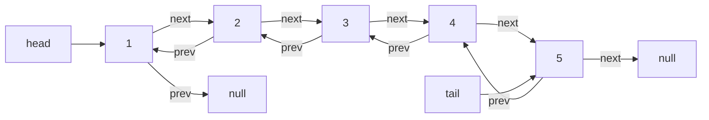
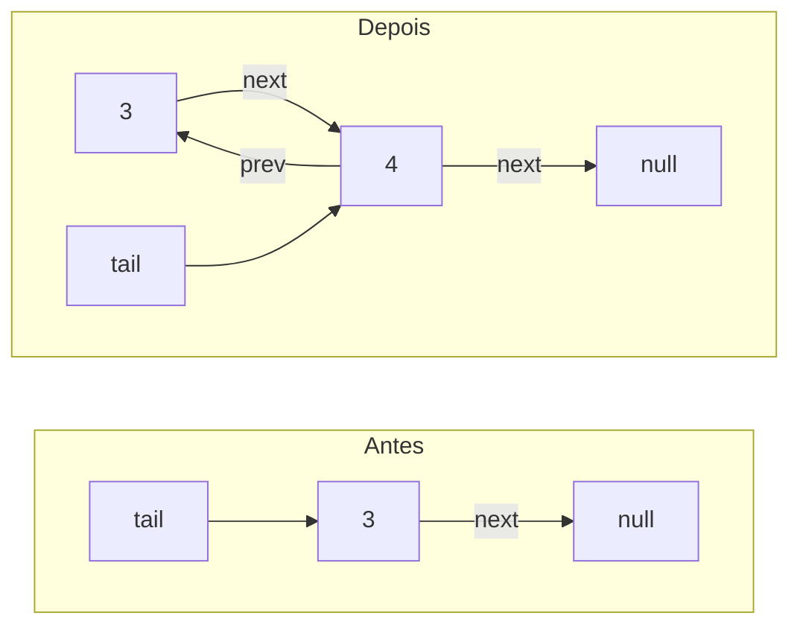

# Explicação — Linked List

Esta pasta contém a implementação de uma **lista duplamente encadeada** no arquivo `linked.py`.

---

## Lista Duplamente Encadeada — `linked.py`

### O que é

Uma **lista encadeada** é uma sequência de nós onde cada nó guarda um valor e um ponteiro para o próximo nó (`next`). A lista **duplamente** encadeada também guarda um ponteiro para o nó anterior (`prev`), permitindo andar para frente e para trás.

Duas vantagens em relação ao array:

- **Inserção/remoção no início e no fim em O(1)** — não precisa "empurrar" elementos.
- **Crescimento dinâmico** — não precisa de tamanho fixo.

A classe `DoublyLinkedList` mantém dois ponteiros de extremidade:

- `head` → primeiro nó da lista.
- `tail` → último nó da lista.

### Estrutura da lista

Cada nó tem `value`, `next` (para o próximo) e `prev` (para o anterior):

Repare nas pontas: o `prev` do primeiro nó aponta para `null`, e o `next` do último nó aponta para `null`. Isso é o que delimita a lista.

### Passo a passo

Vamos montar uma lista chamando os métodos na ordem do teste do arquivo:

**Montagem:**

| Chamada | Estado da lista (head → tail) |
|---|---|
| `add_to_front(3)` | 3 |
| `add_to_front(2)` | 2 → 3 |
| `add_to_front(1)` | 1 → 2 → 3 |
| `add_to_end(4)` | 1 → 2 → 3 → 4 |
| `add_to_end(5)` | 1 → 2 → 3 → 4 → 5 |

**Remoções (teste, linhas 68-71):**

| Chamada | Remove | Lista resultante |
|---|---|---|
| `remove_from_front()` | 1 | 2 → 3 → 4 → 5 |
| `remove_from_end()` | 5 | 2 → 3 → 4 |
| `remove_from_front()` | 2 | 3 → 4 |
| `remove_from_end()` | 4 | 3 |

Saída impressa pelo script: `1`, `5`, `2`, `4`.

**Como funciona o `add_to_end` (versão correta):** o novo nó aponta `prev` para o `tail` atual, o `tail` atual aponta `next` para o novo nó, e o novo nó vira o `tail`:

### Complexidade

| Operação | Tempo | Espaço |
|---|---|---|
| `add_to_front` | O(1) | O(1) (cria 1 nó) |
| `add_to_end` | O(1) | O(1) |
| `remove_from_front` | O(1) | O(1) |
| `remove_from_end` | O(1) | O(1) |
| Buscar um valor no meio | O(n) | O(1) |

Como temos ponteiros diretos para `head` e `tail`, as quatro operações nas pontas não precisam percorrer a lista — por isso O(1).

### Referência ao arquivo

- Classe `Node` — `linked.py:1-5`
- Classe `DoublyLinkedList` — `linked.py:7-55`
- `add_to_front` — `linked.py:12-19`
- `add_to_end` — `linked.py:22-29`
- `remove_from_front` — `linked.py:33-43`
- `remove_from_end` — `linked.py:45-55`
- Teste de montagem/remoção — `linked.py:59-71`

### Para saber mais

A lista duplamente encadeada é um conceito muito bem documentado. O melhor ponto de partida em português é a Wikipédia; o artigo do DataCamp traz a implementação em Python, que é exatamente o que você está estudando aqui:

- **Lista duplamente ligada — Wikipédia (pt):** https://pt.wikipedia.org/wiki/Lista_duplamente_ligada
- **Python Linked Lists — DataCamp (pt):** https://www.datacamp.com/pt/tutorial/python-linked-lists

Dica: o LeetCode tem uma lista inteira de problemas de listas encadeadas (o problema *206. Reverse Linked List* é o mais famoso). O curso da DSA também usa listas encadeadas no módulo de LeetCode.
