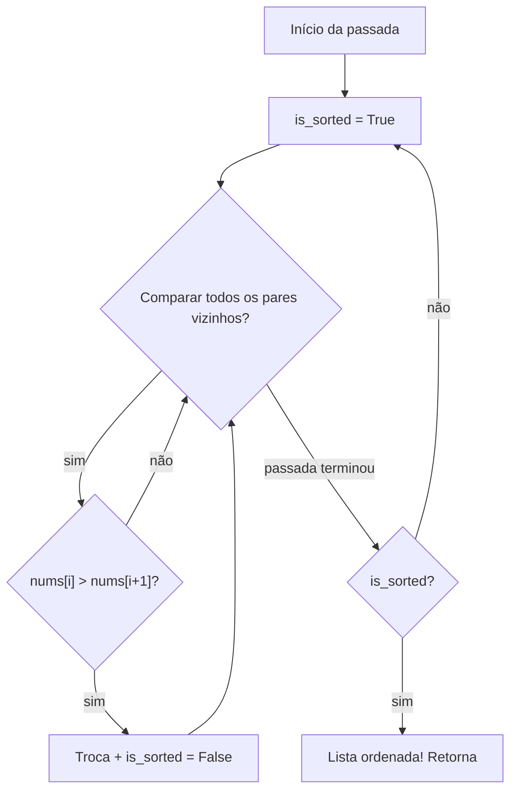
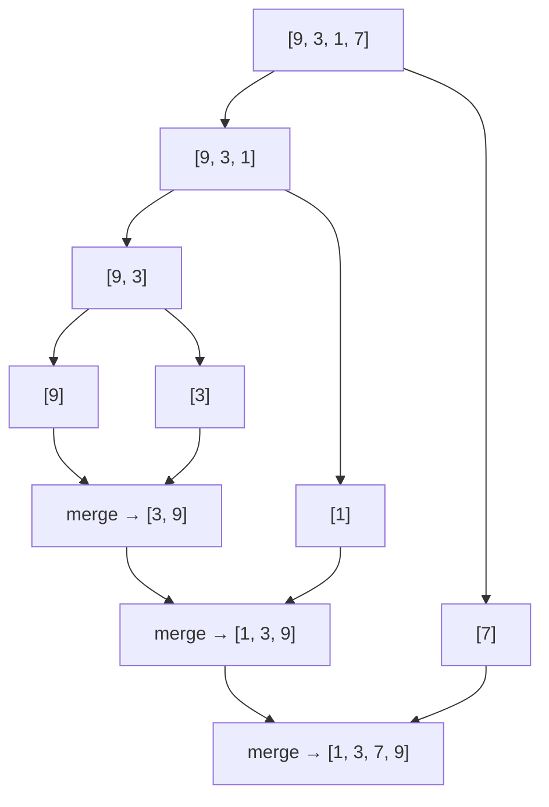
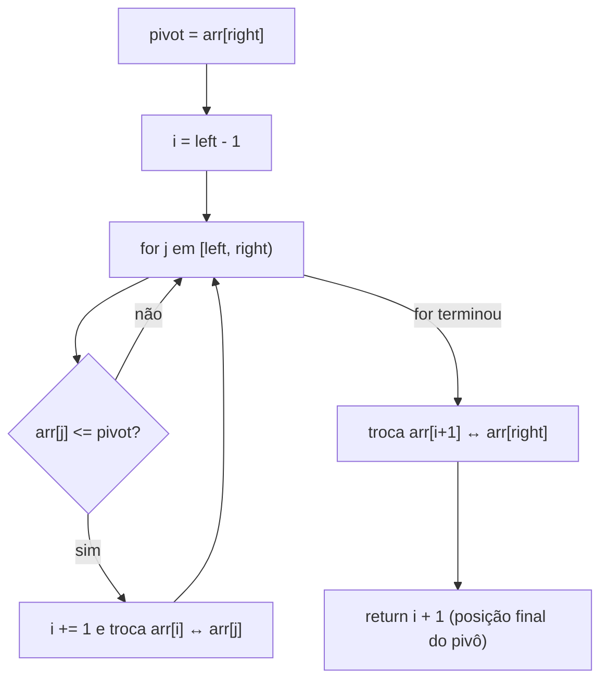
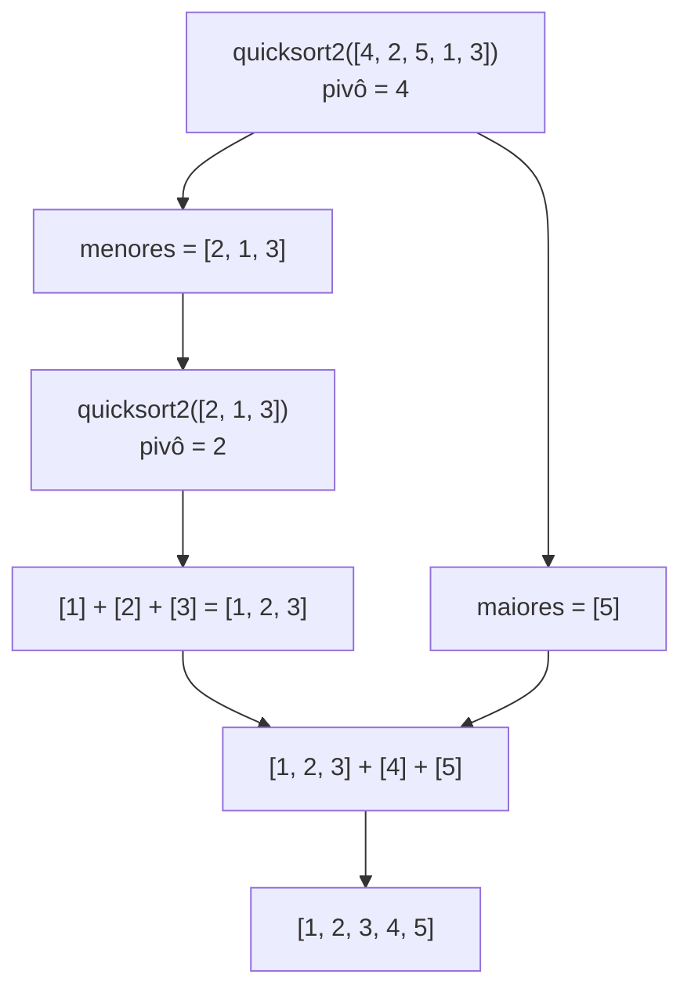

# Explicação — Sorting

Esta pasta contém 4 algoritmos de ordenação, cada um em um arquivo `.py`:

- `bubble_sort.py` — Bubble Sort
- `mergesort.py` — Merge Sort (em lista encadeada)
- `quicksort.py` — Quick Sort (partição de Lomuto, in-place)
- `quicksort2.py` — Quick Sort (versão funcional simples)

---

## Bubble Sort — `bubble_sort.py`

### O que é

O algoritmo mais simples de ordenar. A ideia: percorrer o array repetidamente comparando **elementos vizinhos** e **trocando** quando estão na ordem errada. A cada passada, o maior elemento "flutua" (como uma bolha) até o final — por isso o nome.

É simples de entender, mas **lento** para arrays grandes.

### Passo a passo

Exemplo: `[5, 4, 3, 2, 1]` (pior caso — tudo invertido).

**Passada 1** — compara e troca os vizinhos, o 5 vai para o fim:
`[5,4,3,2,1] → [4,5,3,2,1] → [4,3,5,2,1] → [4,3,2,5,1] → [4,3,2,1,5]`

**Passada 2:** `[3,2,1,4,5]`
**Passada 3:** `[2,1,3,4,5]`
**Passada 4:** `[1,2,3,4,5]` — ordenado!

Detalhe: como não houve trocas na passada 4, o algoritmo poderia parar. O array `[1,2,3,4,5]` (já ordenado) requer só **uma** passada para confirmar.

### Ilustração Mermaid

Este diagrama mostra a **lógica do algoritmo**:



### Complexidade

| | Tempo | Espaço |
|---|---|---|
| Melhor caso (já ordenado) | O(n) | O(1) |
| Pior caso (invertido) | O(n²) | O(1) |
| Caso médio | O(n²) | O(1) |

Motivo do O(n²): são n passadas, cada uma com até n comparações. Ordenar 1000 elementos exige ~1 milhão de comparações.

### Referência ao arquivo

- Função `bubble(nums)` — `bubble_sort.py:1-11`
- Loop externo (passadas): `bubble_sort.py:3`
- Loop interno (pares vizinhos): `bubble_sort.py:6-7`
- Testes: `bubble_sort.py:15-16`

### Para saber mais

O Bubble Sort é o primeiro algoritmo de ordenação que todo mundo aprende. Em português, o blog RoarBit explica ele e mais dois algoritmos (Merge e Quick) em um só artigo, com exemplos:

- **Bubble sort — Wikipédia (pt):** https://pt.wikipedia.org/wiki/Bubble_sort
- **Algoritmos de ordenação explicados — Bubble, Merge e Quick (RoarBit, pt):** https://blog.roarbit.com.br/algoritmos-de-ordenacao-explicados-bubble-sort-merge-sort-e-quick-sort/
- **Visualização animada dos algoritmos de ordenação (VisuAlgo, en):** https://visualgo.net/en/sorting

O VisuAlgo é ótimo para "ver" o Bubble Sort acontecendo passo a passo — vale clicar em *Bubble* e depois em *Sort*.

---

## Merge Sort — `mergesort.py`

### O que é

O Merge Sort é o algoritmo que melhor representa a estratégia **dividir e conquistar**:

1. **Dividir:** cortar a lista ao meio, de novo e de novo, até sobrar listas de 1 elemento (que já são "ordenadas" por natureza).
2. **Conquistar (merge):** juntar as metades ordenadas de volta, intercalando os valores em ordem.

Esta implementação ordena uma **lista encadeada** (não um array), então o "meio" é encontrado com os **dois ponteiros** (`slow`/`fast`) em vez de `len(arr)//2`.

### Passo a passo

Exemplo: ordenar `9 → 3 → 1 → 7`.

**Fase de divisão:**

```
[9, 3, 1, 7]
├── left  = [9, 3, 1]   (do find_middle: slow para no nó do 1)
│   ├── left  = [9, 3]
│   │   ├── [9]
│   │   └── [3]
│   └── right = [1]
└── right = [7]
```

**Fase de junção (merge):**

```
merge([9], [3])          → [3, 9]
merge([3, 9], [1])       → [1, 3, 9]
merge([1, 3, 9], [7])    → [1, 3, 7, 9]  ← lista final ordenada
```

O `merge` compara os primeiros elementos das duas listas e sempre pega o **menor**:

- `[3,9]` vs `[1,7]`: 1 é menor que 3 → pega 1; depois 3; depois 7; depois 9 → `[1,3,7,9]`.

### Ilustração Mermaid



As setas para baixo são a **divisão**; as de volta para cima são as **junções ordenadas**.

### Complexidade

| | Tempo | Espaço |
|---|---|---|
| Melhor caso | O(n log n) | O(log n) de pilha de recursão* |
| Pior caso | O(n log n) | O(log n) |
| Caso médio | O(n log n) | O(log n) |

\* O merge em lista encadeada é feito "no lugar" (só reposiciona ponteiros), então não gasta array extra. A versão com arrays gastaria O(n) de espaço.

O tempo é **sempre** O(n log n): cada nível de divisão tem O(n) de trabalho no merge, e existem log₂(n) níveis.

### Referência ao arquivo

- `find_middle(head)` — `mergesort.py:1-8` (ponteiros `slow`/`fast`)
- `merge(l1, l2)` — `mergesort.py:10-24` (intercala duas listas ordenadas)
- `mergesort(head)` — `mergesort.py:27-39` (recursão + divisão)
- `print_list(head)` — `mergesort.py:42-46` (imprime a lista)
- Classe `Node` — `mergesort.py:49-52`
- Teste — `mergesort.py:55-62` (ordena `9→3→1→7`, imprime `1 -> 3 -> 7 -> 9`)

### Para saber mais

O Merge Sort é o exemplo canônico de **dividir e conquistar** — entender o diagrama acima de junção intercalada fica mais fácil vendo a mesma ideia em texto e em animação:

- **Merge sort — Wikipédia (pt):** https://pt.wikipedia.org/wiki/Merge_sort
- **Algoritmos de ordenação explicados — Bubble, Merge e Quick (RoarBit, pt):** https://blog.roarbit.com.br/algoritmos-de-ordenacao-explicados-bubble-sort-merge-sort-e-quick-sort/
- **Visualização animada dos algoritmos de ordenação (VisuAlgo, en):** https://visualgo.net/en/sorting

---

## Quick Sort — `quicksort.py`

### O que é

O Quick Sort também usa dividir e conquistar, mas com uma estratégia diferente: escolhe um **pivô**, rearranja o array para que tudo **menor ou igual** ao pivô fique à esquerda e tudo **maior** fique à direita (isso é a **partição**), e então ordena cada lado recursivamente.

Aqui o pivô é o **último elemento** do intervalo, e a partição é a **de Lomuto** (percorre com `j` e mantém um "muro" em `i`). Tudo é feito **in-place** — sem criar arrays novos.

### Passo a passo

Exemplo: `arr = [0, 3, 6, 7, 8, 4, 2, 1, 5]`, primeira chamada `quicksort(arr, 0, 8)`.

Pivô = `5` (último). `i` começa em `-1`. Vamos varrer `j` de 0 a 7:

| j | arr[j] | arr[j] <= 5? | Ação | Array |
|---|--------|--------------|------|-------|
| 0 | 0 | sim | i=0, troca arr[0]↔arr[0] | `[0,3,6,7,8,4,2,1,5]` |
| 1 | 3 | sim | i=1, troca arr[1]↔arr[1] | `[0,3,6,7,8,4,2,1,5]` |
| 2 | 6 | não | — | `[0,3,6,7,8,4,2,1,5]` |
| 3 | 7 | não | — | `[0,3,6,7,8,4,2,1,5]` |
| 4 | 8 | não | — | `[0,3,6,7,8,4,2,1,5]` |
| 5 | 4 | sim | i=2, troca arr[2]↔arr[5] | `[0,3,4,7,8,6,2,1,5]` |
| 6 | 2 | sim | i=3, troca arr[3]↔arr[6] | `[0,3,4,2,8,6,7,1,5]` |
| 7 | 1 | sim | i=4, troca arr[4]↔arr[7] | `[0,3,4,2,1,6,7,8,5]` |

Terminou o loop: troca `arr[i+1]` com `arr[right]` → `arr[5] ↔ arr[8]`:
`[0, 3, 4, 2, 1, **5**, 7, 8, 6]`

O pivô `5` está agora na **posição correta** (índice 5). A partir daí:
- `quicksort(arr, 0, 4)` ordena `[0,3,4,2,1]`
- `quicksort(arr, 6, 8)` ordena `[7,8,6]`

No final o array inteiro fica `[0,1,2,3,4,5,6,7,8]`.

### Ilustração Mermaid



### Complexidade

| | Tempo | Espaço |
|---|---|---|
| Melhor caso | O(n log n) | O(log n) de recursão |
| Pior caso | O(n²) | O(n) de recursão |
| Caso médio | O(n log n) | O(log n) |

O pior caso acontece quando o pivô é sempre o menor/maior elemento (ex.: array já ordenado) — aí um lado fica vazio e a recursão vira O(n) de profundidade.

### Referência ao arquivo

- `quicksort(arr, left, right)` — `quicksort.py:1-6` (recursão)
- `partition(arr, left, right)` — `quicksort.py:9-20` (partição de Lomuto)
- Pivô: `quicksort.py:10`
- Colocação final do pivô: `quicksort.py:19`
- Teste — `quicksort.py:22-23` (ordena `[0,3,6,7,8,4,2,1,5]`)

### Para saber mais

O Quick Sort tem uma pegada conceitual mais difícil (partição, pivô, caso O(n²)) — vale ler mais de uma fonte e ver a animação:

- **Quicksort — Wikipédia (pt):** https://pt.wikipedia.org/wiki/Quicksort
- **Algoritmos de ordenação explicados — Bubble, Merge e Quick (RoarBit, pt):** https://blog.roarbit.com.br/algoritmos-de-ordenacao-explicados-bubble-sort-merge-sort-e-quick-sort/
- **Visualização animada dos algoritmos de ordenação (VisuAlgo, en):** https://visualgo.net/en/sorting

---

## Quick Sort (versão funcional) — `quicksort2.py`

### O que é

A mesma ideia do Quick Sort, mas numa versão **mais simples de ler**: em vez de mexer no array original com índices, ela **cria listas novas** a cada passo usando compreensão de listas (`list comprehensions`).

- Pivô = **primeiro** elemento.
- `less_than_pivot` = todos os menores ou iguais ao pivô.
- `bigger_than_pivot` = todos os maiores.
- Resultado = `quicksort2(menores) + [pivô] + quicksort2(maiores)`.

É o algoritmo mais legível desta pasta — ideal para **entender o conceito** antes de ver a versão in-place.

### Passo a passo

Exemplo: `[4, 2, 5, 1, 3]`, pivô = `4`.

```
menores = [2, 1, 3]     maiores = [5]
quicksort2([2, 1, 3]):
    pivô = 2
    menores = [1]       maiores = [3]
    → [1] + [2] + [3] = [1, 2, 3]
resultado = [1, 2, 3] + [4] + [5] = [1, 2, 3, 4, 5]
```

### Ilustração Mermaid



### Complexidade

| | Tempo | Espaço |
|---|---|---|
| Melhor caso | O(n log n) | O(n) extra (cria listas novas) |
| Pior caso | O(n²) | O(n) |
| Caso médio | O(n log n) | O(n) |

A diferença para o `quicksort.py`: esta versão **gasta O(n) de memória extra** por nível porque cria arrays novos a cada recursão — o preço da legibilidade.

### Referência ao arquivo

- Função `quicksort2(arr)` — `quicksort2.py:1-8`
- Caso base: `quicksort2.py:2-3`
- Pivô e divisões: `quicksort2.py:5-7`
- Junção recursiva: `quicksort2.py:8`
- Teste — `quicksort2.py:13-18` (imprime `[0, 1, 2, 3, 4, 5, 6, 7, 8]`)

### Para saber mais

Esta versão é a mesma ideia do `quicksort.py`, então os mesmos links valem — o foco aqui é ler a versão recursiva "ingênua" (que cria listas novas) para fixar o conceito antes de atacar a versão in-place:

- **Quicksort — Wikipédia (pt):** https://pt.wikipedia.org/wiki/Quicksort
- **Algoritmos de ordenação explicados — Bubble, Merge e Quick (RoarBit, pt):** https://blog.roarbit.com.br/algoritmos-de-ordenacao-explicados-bubble-sort-merge-sort-e-quick-sort/
- **Visualização animada dos algoritmos de ordenação (VisuAlgo, en):** https://visualgo.net/en/sorting
