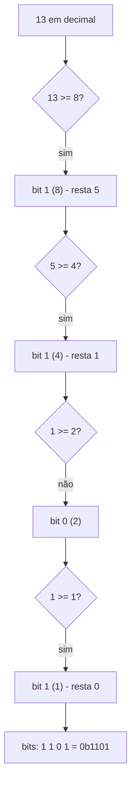
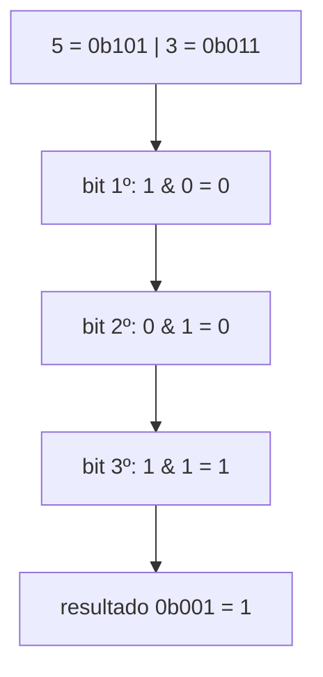
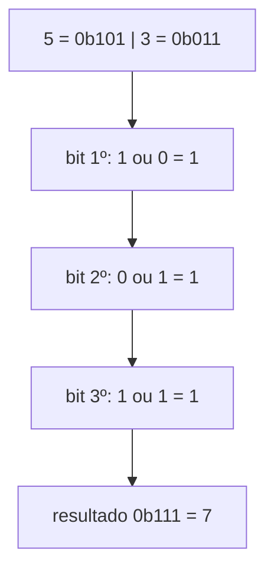
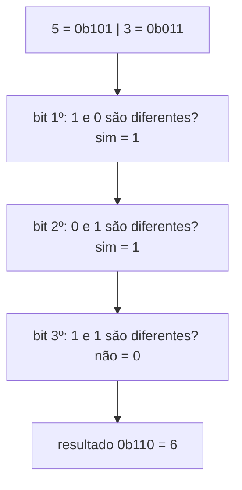
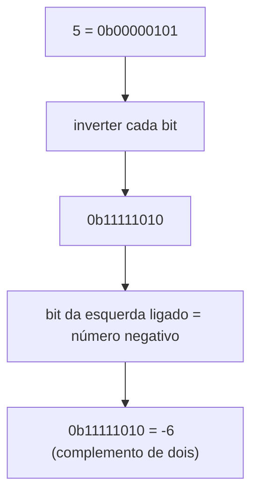
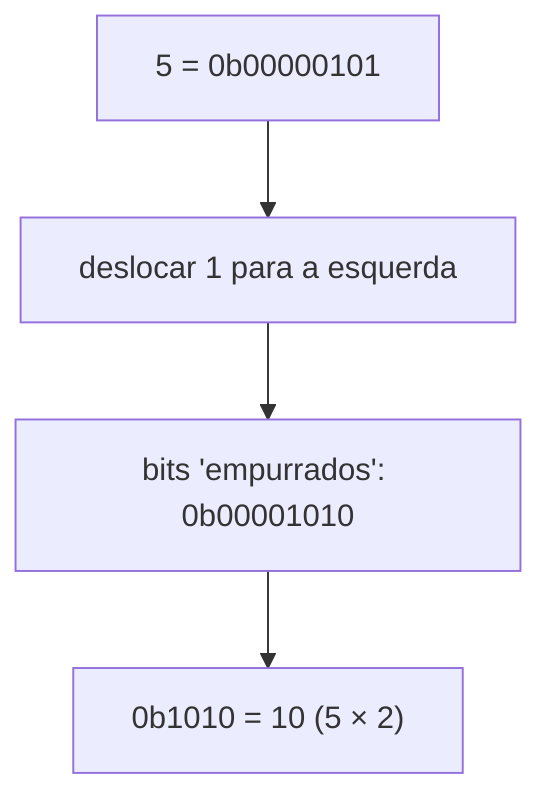
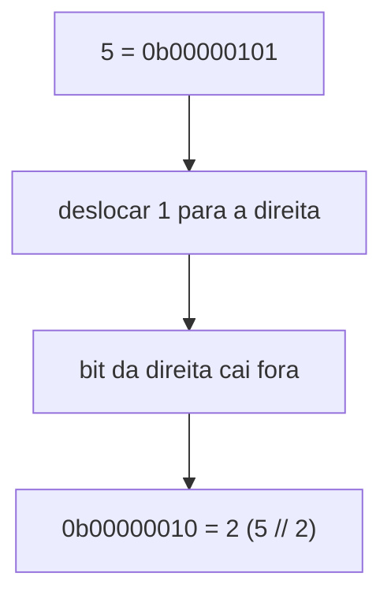

# Explicação — Binários

Esta pasta contém um arquivo que ensina **como o computador representa números inteiros e como operar sobre eles bit a bit**:

- `bitwise_ops.py` — representação binária + as 6 operações bitwise (AND, OR, XOR, NOT, LEFT SHIFT, RIGHT SHIFT)

O arquivo imprime cada operação em decimal e em binário, para você ver o que acontece "por baixo dos panos". Vamos entender cada parte.

---

## 1. Representação binária — `decimal_para_binario`

### O que é

Todo número inteiro, para o computador, é um **conjunto de bits** (0 e 1). Essa é a sua anotação *"TODO NUMERO INTEIRO É REPRESENTADO POR BINÁRIO"*.

A outra anotação — *"BINÁRIO EQUIVALE A POTENCIA DE 2"* — é a chave para converter: cada posição de um número binário vale uma **potência de 2**. Da direita para a esquerda:

| Posição | 2⁷ | 2⁶ | 2⁵ | 2⁴ | 2³ | 2² | 2¹ | 2⁰ |
|---------|------|------|------|------|------|------|------|------|
| Valor   | 128 | 64 | 32 | 16 | 8 | 4 | 2 | 1 |

Um bit `1` na posição significa que você **soma** aquele valor. Um bit `0` significa que você ignora.

### Passo a passo

Converter `13` para binário:

1. Escreva `13` como soma de potências de 2: `13 = 8 + 4 + 1`.
2. Marque com `1` as potências usadas (8, 4 e 1) e com `0` as que não foram usadas (2).
3. Leia da esquerda para a direita: `1 1 0 1` → `0b1101`.

Conferindo: `0b1101 = 8 + 4 + 0 + 1 = 13`. ✓

No arquivo, `bin(13)` retorna a string `'0b1101'` diretamente (o Python já faz essa conversão para você).

### Ilustração Mermaid



### Complexidade

| | Tempo | Espaço |
|---|---|---|
| `bin(n)` | O(log n) | O(log n) |

Motivo: o número de bits necessários para representar `n` é `log₂(n) + 1`. Para `13`, por exemplo, são 4 bits.

### Referência ao arquivo

- Função `decimal_para_binario(n)` — `bitwise_ops.py:1-3`
- Conversão com `bin(n)`: `bitwise_ops.py:2`
- Exemplos no arquivo: `bitwise_ops.py:31-32`

### Para saber mais

- **Sistema binário — Wikipédia (pt):** https://pt.wikipedia.org/wiki/Sistema_bin%C3%A1rio
- **Binary Number System — Khan Academy (pt):** https://pt.khanacademy.org/computing/computers-and-internet/xcae6f4a7ff015e7d:digital-information
- **Conversor binário animado (Visualizador):** https://www.cs.cmu.edu/~rgs/algor/NumberSystems.html

---

## 2. AND — `and_`

### O que é

O operador `&` compara dois números **bit a bit**. O bit do resultado é `1` **somente se os dois bits comparados forem `1`**.

É a "operação do e": o resultado só é verdadeiro quando as duas coisas são verdadeiras.

Tabela verdade do AND (por bit):

| a | b | a & b |
|---|---|-------|
| 0 | 0 | 0 |
| 0 | 1 | 0 |
| 1 | 0 | 0 |
| 1 | 1 | **1** |

### Passo a passo

`5 & 3`:

1. Alinhe os bits à direita: `5 = 0b101` e `3 = 0b011`.
2. Compare bit a bit (preenchendo com zeros à esquerda para ficarem do mesmo tamanho):

| Bit (esquerda→direita) | 5 | 3 | 5 & 3 |
|------------------------|-----|-----|-------|
| 1º | 1 | 0 | 0 |
| 2º | 0 | 1 | 0 |
| 3º | 1 | 1 | **1** |

3. Resultado: `0b001 = 1`. Então `5 & 3 = 1`. ✓

Saída real do arquivo:

```
5 & 3 = 1
  0b00000101 & 0b00000011 = 0b00000001
```

### Ilustração Mermaid



### Complexidade

| | Tempo | Espaço |
|---|---|---|
| `a & b` | O(1) | O(1) |

O processador executa o AND sobre os bits em uma única instrução, independente do valor dos números.

### Referência ao arquivo

- Função `and_(a, b)` — `bitwise_ops.py:5-7`
- Resultado em decimal: `bitwise_ops.py:6`
- Resultado em binário (8 bits): `bitwise_ops.py:7`
- Exemplo no arquivo: `bitwise_ops.py:35`

### Para saber mais

- **Operadores bit a bit — Wikipédia (pt):** https://pt.wikipedia.org/wiki/Operador_bit_a_bit
- **Bitwise Operators — GeeksforGeeks (en):** https://www.geeksforgeeks.org/python-bitwise-operators/
- **Visualizador interativo (VisuAlgo):** https://visualgo.net/en/bitmask

---

## 3. OR — `or_`

### O que é

O operador `|` também compara dois números **bit a bit**, mas o bit do resultado é `1` se **pelo menos um** dos dois bits for `1`.

É a "operação do ou": basta uma das coisas ser verdadeira.

Tabela verdade do OR (por bit):

| a | b | a \| b |
|---|---|-------|
| 0 | 0 | 0 |
| 0 | 1 | **1** |
| 1 | 0 | **1** |
| 1 | 1 | **1** |

### Passo a passo

`5 | 3`:

| Bit | 5 | 3 | 5 \| 3 |
|-----|-----|-----|-------|
| 1º | 1 | 0 | **1** |
| 2º | 0 | 1 | **1** |
| 3º | 1 | 1 | **1** |

Resultado: `0b111 = 7`. Então `5 | 3 = 7`. ✓

Repare: enquanto o AND "apagava" bits, o OR "acende" qualquer bit que esteja ligado em pelo menos um dos números.

Saída real do arquivo:

```
5 | 3 = 7
  0b00000101 | 0b00000011 = 0b00000111
```

### Ilustração Mermaid



### Complexidade

| | Tempo | Espaço |
|---|---|---|
| `a \| b` | O(1) | O(1) |

### Referência ao arquivo

- Função `or_(a, b)` — `bitwise_ops.py:9-11`
- Resultado em decimal: `bitwise_ops.py:10`
- Resultado em binário (8 bits): `bitwise_ops.py:11`
- Exemplo no arquivo: `bitwise_ops.py:38`

### Para saber mais

- **Operadores bit a bit — Wikipédia (pt):** https://pt.wikipedia.org/wiki/Operador_bit_a_bit
- **Bitwise Operators — GeeksforGeeks (en):** https://www.geeksforgeeks.org/python-bitwise-operators/

---

## 4. XOR — `xor_`

### O que é

O operador `^` (lê-se "ou exclusivo", ou *exclusive or*) compara dois números bit a bit, e o resultado é `1` **somente quando os dois bits são diferentes**.

É a "operação do diferente": se os bits batem, dá 0; se não batem, dá 1.

Tabela verdade do XOR (por bit):

| a | b | a ^ b |
|---|---|-------|
| 0 | 0 | 0 |
| 0 | 1 | **1** |
| 1 | 0 | **1** |
| 1 | 1 | 0 |

### Passo a passo

`5 ^ 3`:

| Bit | 5 | 3 | 5 ^ 3 |
|-----|-----|-----|-------|
| 1º | 1 | 0 | **1** |
| 2º | 0 | 1 | **1** |
| 3º | 1 | 1 | 0 |

Resultado: `0b110 = 6`. Então `5 ^ 3 = 6`. ✓

Saída real do arquivo:

```
5 ^ 3 = 6
  0b00000101 ^ 0b00000011 = 0b00000110
```

### Ilustração Mermaid



### Complexidade

| | Tempo | Espaço |
|---|---|---|
| `a ^ b` | O(1) | O(1) |

### Referência ao arquivo

- Função `xor_(a, b)` — `bitwise_ops.py:13-15`
- Resultado em decimal: `bitwise_ops.py:14`
- Resultado em binário (8 bits): `bitwise_ops.py:15`
- Exemplo no arquivo: `bitwise_ops.py:41`

### Para saber mais

O XOR é o operador favorito de problemas de bit manipulation no LeetCode, porque ele **anula bits repetidos** (famoso truque do "elemento que aparece uma vez"):

- **Operadores bit a bit — Wikipédia (pt):** https://pt.wikipedia.org/wiki/Operador_bit_a_bit
- **XOR — Wikipédia (pt):** https://pt.wikipedia.org/wiki/Ou_exclusivo
- **LeetCode 136. Single Number (problema clássico de XOR):** https://leetcode.com/problems/single-number/

---

## 5. NOT — `not_`

### O que é

O operador `~` **inverte cada bit** do número: os `0` viram `1` e os `1` viram `0`.

Tabela verdade do NOT (por bit):

| a | ~a |
|---|---|
| 0 | 1 |
| 1 | 0 |

### Passo a passo

`~5` no Python:

1. `5` em 8 bits é `0b00000101`.
2. Inverta cada bit: `0b11111010`.
3. Porém, no Python (e em quase todos os computadores), o primeiro bit indica o **sinal**: o binário com todos os bits ligados representa um número **negativo** (complemento de dois).
4. `0b11111010` = `-6`. Então `~5 = -6`. ✓

Regra prática: `~n = -(n + 1)`. Confira: `~5 = -(5 + 1) = -6`. ✓

Saída real do arquivo:

```
~5 = -6
  ~0b00000101 = 0b11111010  (em 8 bits)
```

A linha de baixo mostra a inversão "crua" dos bits. O valor decimal negativo aparece porque o computador interpreta o bit mais à esquerda como sinal.

### Ilustração Mermaid



### Complexidade

| | Tempo | Espaço |
|---|---|---|
| `~n` | O(1) | O(1) |

### Referência ao arquivo

- Função `not_(n)` — `bitwise_ops.py:17-19`
- Resultado em decimal: `bitwise_ops.py:18`
- Inversão dos bits em 8 bits (com máscara `0xFF`): `bitwise_ops.py:19`
- Exemplo no arquivo: `bitwise_ops.py:44`

### Para saber mais

- **Complemento de dois — Wikipédia (pt):** https://pt.wikipedia.org/wiki/Complemento_para_dois
- **Operadores bit a bit — Wikipédia (pt):** https://pt.wikipedia.org/wiki/Operador_bit_a_bit

---

## 6. LEFT SHIFT — `left_shift`

### O que é

O operador `<<` **desloca todos os bits para a esquerda** e preenche com zeros à direita. Cada posição deslocada multiplica o número por 2 (porque deslocar é "empurrar" os bits para casas que valem o dobro).

`a << b` é equivalente a `a * 2^b`.

### Passo a passo

`5 << 1`:

1. `5 = 0b00000101`.
2. Desloque 1 posição para a esquerda e adicione um `0` à direita: `0b00001010`.
3. `0b1010 = 10`. Então `5 << 1 = 10`. ✓ (5 × 2 = 10)

Se fosse `5 << 3`: `5 × 2³ = 5 × 8 = 40`. O deslocamento multiplica por 2 a cada posição.

Saída real do arquivo:

```
5 << 1 = 10
  0b00000101 << 1 = 0b00001010
```

### Ilustração Mermaid



### Complexidade

| | Tempo | Espaço |
|---|---|---|
| `a << b` | O(1) | O(1) |

### Referência ao arquivo

- Função `left_shift(n, desloc)` — `bitwise_ops.py:21-23`
- Resultado em decimal: `bitwise_ops.py:22`
- Resultado em binário (8 bits): `bitwise_ops.py:23`
- Exemplo no arquivo: `bitwise_ops.py:47`

### Para saber mais

- **Deslocamento de bits — Wikipédia (pt):** https://pt.wikipedia.org/wiki/Deslocamento_de_bits
- **Bitwise Operators — GeeksforGeeks (en):** https://www.geeksforgeeks.org/python-bitwise-operators/

---

## 7. RIGHT SHIFT — `right_shift`

### O que é

O operador `>>` **desloca todos os bits para a direita**. Os bits da direita "caem fora" e o resultado é a **divisão inteira por 2** a cada posição deslocada.

`a >> b` é equivalente a `a // 2^b`.

### Passo a passo

`5 >> 1`:

1. `5 = 0b00000101`.
2. Desloque 1 posição para a direita: o bit mais à direita (`1`) cai fora, e sobra `0b00000010`.
3. `0b10 = 2`. Então `5 >> 1 = 2`. ✓ (5 // 2 = 2)

Se fosse `5 >> 2`: `5 // 2² = 5 // 4 = 1`. Repare que a divisão é **inteira** — a parte quebrada é descartada.

Saída real do arquivo:

```
5 >> 1 = 2
  0b00000101 >> 1 = 0b00000010
```

### Ilustração Mermaid



### Complexidade

| | Tempo | Espaço |
|---|---|---|
| `a >> b` | O(1) | O(1) |

### Referência ao arquivo

- Função `right_shift(n, desloc)` — `bitwise_ops.py:25-27`
- Resultado em decimal: `bitwise_ops.py:26`
- Resultado em binário (8 bits): `bitwise_ops.py:27`
- Exemplo no arquivo: `bitwise_ops.py:50`

### Para saber mais

- **Deslocamento de bits — Wikipédia (pt):** https://pt.wikipedia.org/wiki/Deslocamento_de_bits
- **LeetCode 191. Number of 1 Bits (problema que usa `>>` e `&`):** https://leetcode.com/problems/number-of-1-bits/

---

## Resumo rápido

| Operação | Símbolo | Regra por bit | Exemplo (5 e 3) |
|----------|---------|---------------|-----------------|
| AND | `&` | 1 só se os dois forem 1 | `5 & 3 = 1` |
| OR | `\|` | 1 se pelo menos um for 1 | `5 \| 3 = 7` |
| XOR | `^` | 1 se os bits forem diferentes | `5 ^ 3 = 6` |
| NOT | `~` | inverte cada bit | `~5 = -6` |
| LEFT SHIFT | `<<` | multiplica por 2 a cada casa | `5 << 1 = 10` |
| RIGHT SHIFT | `>>` | divide por 2 a cada casa | `5 >> 1 = 2` |

Com AND, OR, XOR e os shifts você resolve a maioria dos problemas de *bit manipulation* do LeetCode, inclusive os dois do arquivo `problema bitwise 1 e 2.md`.
