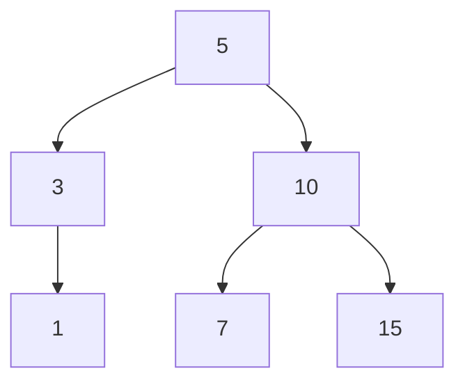
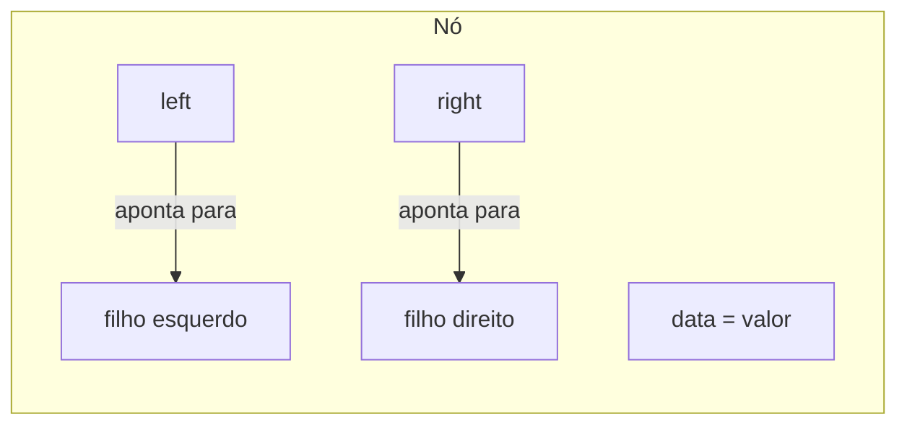
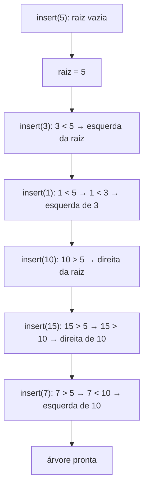
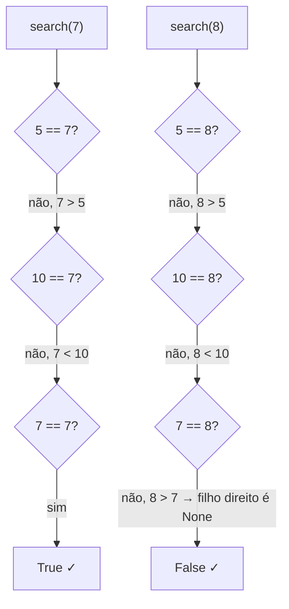
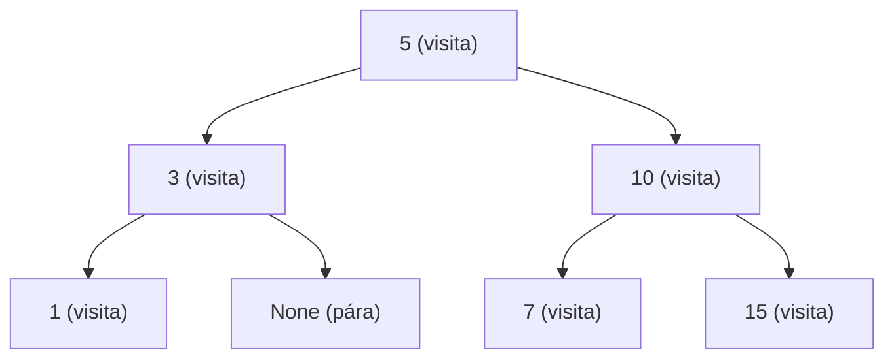
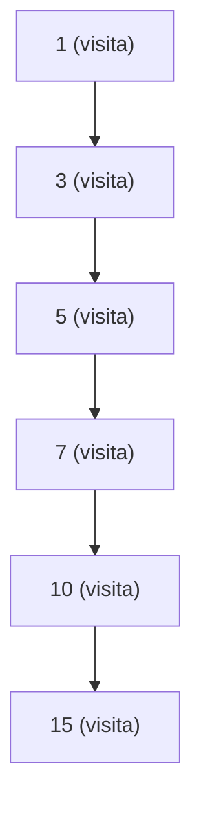
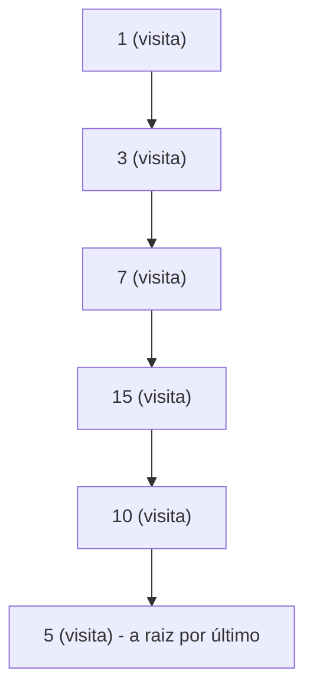

# Explicação — Binary Trees

Esta pasta contém um arquivo que implementa uma **árvore binária de busca** (BST, do inglês *Binary Search Tree*) do zero, do jeito que a aula pediu ("implemente uma binary tree"):

- `binary_tree.py` — classe `Node` (o "nó" da árvore) + classe `BinaryTree` com **inserção**, **busca** e os três percursos clássicos (**preorder**, **inorder** e **postorder**).

Ao final, o arquivo monta uma árvore de exemplo e imprime os três percursos. Vamos entender cada parte.

---

## 0. O que é uma árvore binária de busca

Antes de olhar o código, vale fixar o conceito:

- Uma **árvore binária** é uma estrutura em que cada nó tem **no máximo dois filhos** (esquerdo e direito).
- Uma **árvore binária de busca** adiciona uma regra mágica: na esquerda de um nó ficam os valores **menores** que ele, e na direita ficam os valores **maiores ou iguais** a ele.

Essa regra é o que torna a busca rápida: a cada passo você descarta **metade** da árvore, igual ao `binary_search` do módulo de Arrays.

### Ilustração Mermaid



Esta é a árvore que o arquivo constrói ao final (linhas 75-81). Repare:

- `3` e `1` (menores que `5`) ficaram à esquerda.
- `10`, `7` e `15` (maiores que `5`) ficaram à direita.

---

## 1. O nó — classe `Node`

### O que é

Cada posição da árvore é um **nó**. O nó guarda três coisas:

1. o **dado** (`data`);
2. um ponteiro para o **filho esquerdo** (`left`);
3. um ponteiro para o **filho direito** (`right`).

Quando o nó é criado, ele ainda não tem filhos — por isso `left` e `right` começam como `None`.



### Referência ao arquivo

- Classe `Node` — `binary_tree.py:1-5`
- Atributos `data`, `left`, `right`: `binary_tree.py:3-5`

---

## 2. Inserção — `insert` e `_insert_recursive`

### O que é

Inserir um valor em uma BST significa **descer pela árvore** seguindo a regra: se o novo valor é menor que o nó atual, vá para a esquerda; se é maior ou igual, vá para a direita. Quando você chega em um lugar vazio (`None`), é ali que o novo nó nasce.

### Passo a passo

Vamos construir a árvore do arquivo na ordem dos inserts (linhas 75-81):

1. `insert(5)` → a raiz está vazia, então `5` vira a raiz.
2. `insert(3)` → `3 < 5` → filho esquerdo da raiz = `3`.
3. `insert(1)` → `1 < 5` → vai para o nó `3`; `1 < 3` → filho esquerdo de `3` = `1`.
4. `insert(10)` → `10 > 5` → filho direito da raiz = `10`.
5. `insert(15)` → `15 > 5` → vai para o nó `10`; `15 > 10` → filho direito de `10` = `15`.
6. `insert(7)` → `7 > 5` → vai para o nó `10`; `7 < 10` → filho esquerdo de `10` = `7`.

Resultado:

```
        5
       / \
      3   10
     /   / \
    1   7   15
```



### Complexidade

| | Tempo | Espaço |
|---|---|---|
| `insert` | O(h) — médio O(log n), pior O(n) | O(h) (pilha de recursão) |

Onde `h` é a **altura** da árvore. Em uma árvore equilibrada, `h = O(log n)`. Se os valores forem inseridos em ordem crescente, a árvore vira uma "cobra" e `h = O(n)`.

### Referência ao arquivo

- Método público `insert(data)` — `binary_tree.py:11-15`
- Caso da raiz vazia: `binary_tree.py:12-13`
- Recursão para o filho esquerdo (`data < node.data`): `binary_tree.py:17-22`
- Recursão para o filho direito: `binary_tree.py:23-27`

### Para saber mais

- **Árvore binária de busca — Wikipédia (pt):** https://pt.wikipedia.org/wiki/%C3%81rvore_bin%C3%A1ria_de_busca
- **Binary Search Tree — VisuAlgo (visualizador interativo):** https://visualgo.net/en/bst

---

## 3. Busca — `search` e `_search_recursive`

### O que é

Buscar um valor na BST segue o mesmo "jogo" da inserção: comece na raiz e, a cada nó, **compare** com o valor procurado:

- se é **igual** → achou, retorna `True`;
- se é **menor** → desce para a esquerda;
- se é **maior** → desce para a direita;
- se encontra `None` → não existe, retorna `False`.

### Passo a passo

Procurando `7` na árvore do exemplo:

1. Começa na raiz (`5`). `7 > 5` → desce para a direita.
2. Chega no nó `10`. `7 < 10` → desce para a esquerda.
3. Chega no nó `7`. `7 == 7` → **`True`**. ✓ (3 comparações)

Procurando `8` na mesma árvore:

1. Raiz `5`. `8 > 5` → direita.
2. Nó `10`. `8 < 10` → esquerda.
3. Nó `7`. `8 > 7` → direita, mas `7.right` é `None` → **`False`**. ✓



### Complexidade

| | Tempo | Espaço |
|---|---|---|
| `search` | O(h) — médio O(log n), pior O(n) | O(h) (pilha de recursão) |

Mesma análise da inserção: cada comparação descarta metade da árvore restante quando a árvore está equilibrada.

### Referência ao arquivo

- Método público `search(data)` — `binary_tree.py:29-30`
- Caso base "nó vazio" (`None`) → `False`: `binary_tree.py:33-34`
- Caso "achou" → `True`: `binary_tree.py:35-36`
- Descer para a esquerda: `binary_tree.py:37-38`
- Descer para a direita: `binary_tree.py:39-40`

### Para saber mais

- **Busca binária — Wikipédia (pt):** https://pt.wikipedia.org/wiki/Busca_bin%C3%A1ria
- **Binary Search Tree — VisuAlgo:** https://visualgo.net/en/bst

---

## 4. Percurso preorder — `preorder_traversal` e `_preorder_recursive`

### O que é

"Percorrer" a árvore é visitar todos os nós em uma ordem. No **preorder**, a ordem é **raiz → esquerda → direita**: você visita o nó atual **primeiro**, e só depois desce nos filhos.

É o padrão usado para **copiar** uma árvore ou serializá-la (quando a ordem importa para reconstruir a estrutura).

### Passo a passo

Na árvore do exemplo, o preorder "grita" o valor antes de descer:

```
raiz 5 → esquerda 3 → esquerda 1 → direita de 3 (None) → direita de 5 (10) → esquerda de 10 (7) → direita de 10 (15)
```

Resultado: `[5, 3, 1, 10, 7, 15]` ✓ (confere com a saída do arquivo)



A ordem em que os números são **anotados** no resultado: 5, depois 3, depois 1, depois 10, depois 7, depois 15.

### Complexidade

| | Tempo | Espaço |
|---|---|---|
| `preorder_traversal` | O(n) | O(n) (lista de resultado + pilha de recursão) |

Cada um dos `n` nós é visitado exatamente uma vez, então o tempo é linear em `n`.

### Referência ao arquivo

- Método público `preorder_traversal()` — `binary_tree.py:42-45`
- Visita o nó **antes** dos filhos: `binary_tree.py:49`
- Recursão no filho esquerdo: `binary_tree.py:50`
- Recursão no filho direito: `binary_tree.py:51`

### Para saber mais

- **Árvore binária (percursos) — Wikipédia (pt):** https://pt.wikipedia.org/wiki/%C3%81rvore_bin%C3%A1ria
- **Tree Traversal — VisuAlgo:** https://visualgo.net/en/bst

---

## 5. Percurso inorder — `inorder_traversal` e `_inorder_recursive`

### O que é

No **inorder**, a ordem é **esquerda → raiz → direita**: o nó atual é visitado **entre** os filhos.

O detalhe maravilhoso é que, em uma BST, o inorder devolve os valores **em ordem crescente**. Por isso ele é usado para "ler" a árvore de forma ordenada.

### Passo a passo

Na árvore do exemplo, seguindo sempre esquerda primeiro:

```
esquerda de 5 (3) → esquerda de 3 (1) → 1 → 3 → 5 → direita de 5 (10) → esquerda de 10 (7) → 7 → 10 → 15
```

Resultado: `[1, 3, 5, 7, 10, 15]` ✓ (ordem crescente!)



O percurso "dobra" a árvore no eixo vertical e os nós saem ordenados: `1, 3, 5, 7, 10, 15`.

### Complexidade

| | Tempo | Espaço |
|---|---|---|
| `inorder_traversal` | O(n) | O(n) (lista de resultado + pilha de recursão) |

### Referência ao arquivo

- Método público `inorder_traversal()` — `binary_tree.py:53-56`
- Recursão no filho esquerdo: `binary_tree.py:60`
- Visita o nó **entre** os filhos: `binary_tree.py:61`
- Recursão no filho direito: `binary_tree.py:62`

### Para saber mais

- **Árvore binária (percursos) — Wikipédia (pt):** https://pt.wikipedia.org/wiki/%C3%81rvore_bin%C3%A1ria
- **Binary Search Tree — VisuAlgo:** https://visualgo.net/en/bst

---

## 6. Percurso postorder — `postorder_traversal` e `_postorder_traversal`

### O que é

No **postorder**, a ordem é **esquerda → direita → raiz**: o nó atual é visitado **por último**, depois dos dois filhos.

É o padrão usado para **deletar a árvore** (liberar memória dos filhos antes do pai) e para **calcular a altura** da árvore.

### Passo a passo

Na árvore do exemplo, os filhos são visitados antes do pai:

```
esquerda de 5 (3) → esquerda de 3 (1) → 1 → direita de 3 (None) → 3 → direita de 5 (10) → esquerda de 10 (7) → 7 → direita de 10 (15) → 15 → 10 → 5
```

Resultado: `[1, 3, 7, 15, 10, 5]` ✓ (confere com a saída do arquivo)



Repare que a **raiz** (`5`) só é visitada no **final** — essa é a assinatura do postorder.

### Complexidade

| | Tempo | Espaço |
|---|---|---|
| `postorder_traversal` | O(n) | O(n) (lista de resultado + pilha de recursão) |

### Referência ao arquivo

- Método público `postorder_traversal()` — `binary_tree.py:64-67`
- Recursão no filho esquerdo: `binary_tree.py:71`
- Recursão no filho direito: `binary_tree.py:72`
- Visita o nó **depois** dos filhos: `binary_tree.py:73`

### Para saber mais

- **Árvore binária (percursos) — Wikipédia (pt):** https://pt.wikipedia.org/wiki/%C3%81rvore_bin%C3%A1ria
- **Tree Traversal — VisuAlgo:** https://visualgo.net/en/bst

---

## 7. Montagem da árvore de exemplo

No final do arquivo, a árvore é montada e os três percursos são impressos:

```python
tree = BinaryTree()
tree.insert(5)
tree.insert(3)
tree.insert(1)
tree.insert(10)
tree.insert(15)
tree.insert(7)
```

Saída real:

```
preorder trasversal: [5, 3, 1, 10, 7, 15]
inorder trasversal: [1, 3, 5, 7, 10, 15]
postorder trasversal: [1, 3, 7, 15, 10, 5]
```

(No código e na saída aparece "trasversal" com "s" — o termo correto em inglês é *traversal*.)

### Referência ao arquivo

- Criação da árvore e inserts: `binary_tree.py:75-81`
- Comentários com os percursos esperados: `binary_tree.py:83-85`
- Impressão dos três percursos: `binary_tree.py:87-89`

---

## Resumo rápido

| Operação | Regra | Resultado no exemplo | Complexidade (média) |
|----------|-------|----------------------|----------------------|
| `insert` | menor → esquerda, maior/igual → direita | árvore da figura | O(log n) |
| `search` | compara e desce para um lado | `7` → `True` | O(log n) |
| `preorder` | raiz → esquerda → direita | `[5, 3, 1, 10, 7, 15]` | O(n) |
| `inorder` | esquerda → raiz → direita | `[1, 3, 5, 7, 10, 15]` | O(n) |
| `postorder` | esquerda → direita → raiz | `[1, 3, 7, 15, 10, 5]` | O(n) |

**Dica de memorização:** o prefixo diz *quando* a raiz é visitada — `pre` = antes dos filhos, `in` = entre os filhos (e por isso devolve ordenado na BST), `post` = depois dos filhos.
