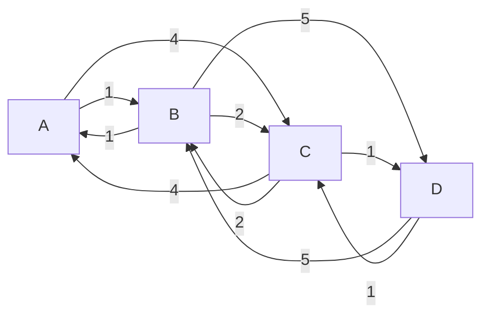
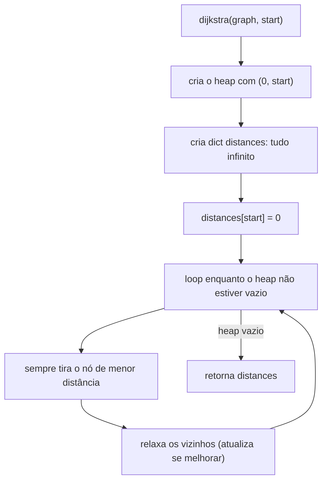
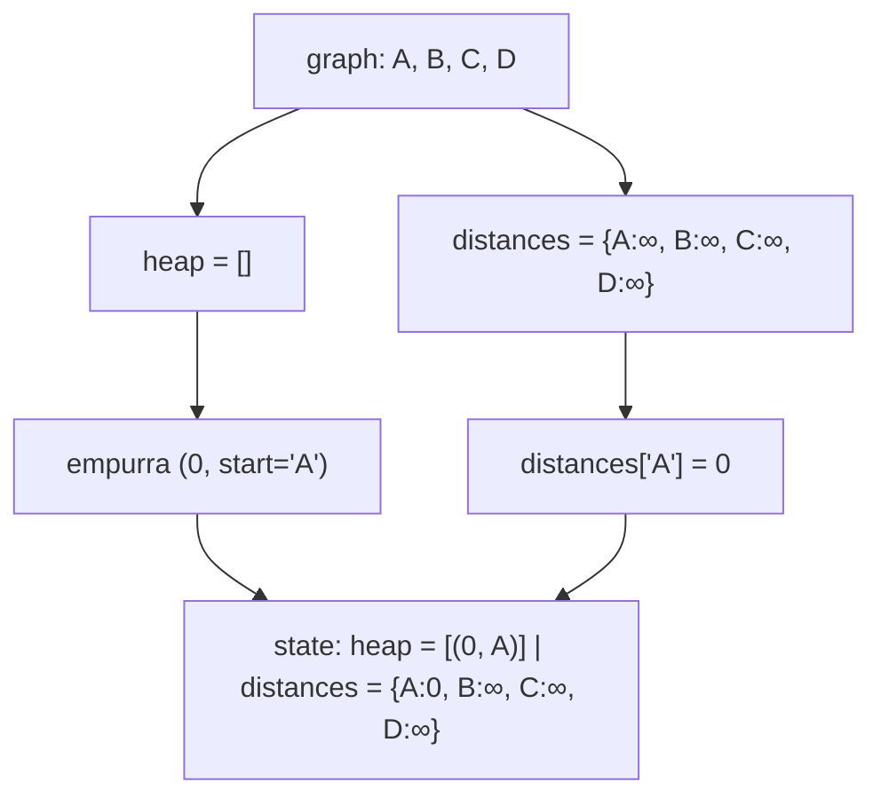
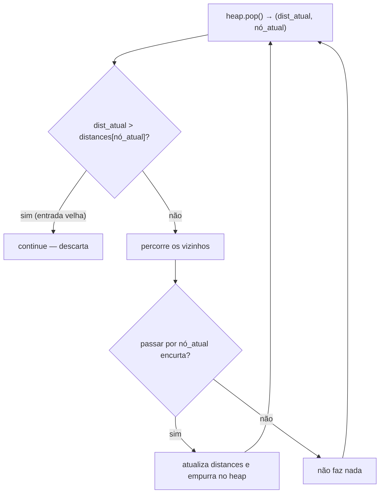
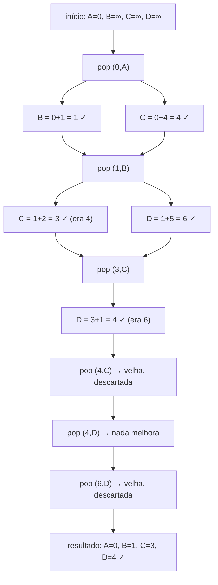

# Explicação — Grafos

Esta pasta contém um arquivo que implementa o **algoritmo de Dijkstra** do zero, do jeito que a aula pediu:

- `dijkstra.py` — função `dijkstra(graph, start)` que calcula a **menor distância** de um nó inicial até todos os outros nós de um grafo ponderado.

Ao final, o arquivo monta um grafo de exemplo, roda o algoritmo a partir do nó `A` e imprime as distâncias mínimas. Vamos entender cada parte.

---

## 0. O que é um grafo e o que é o algoritmo de Dijkstra

Antes de olhar o código, vale fixar os conceitos:

- Um **grafo** é um conjunto de **vértices** (ou nós) ligados por **arestas** (ou conexões). Quando cada aresta tem um "peso" (custo), dizemos que é um grafo **ponderado**.
- O **algoritmo de Dijkstra** (lê-se "Dijckstra") resolve a pergunta: *qual a menor distância do nó inicial até cada outro nó?* É o "GPS" dos grafos: ele acha o caminho mais barato.

A intuição é simples — **"relaxe" a melhor distância conhecida repetidamente**:

- Começa achando que todos os nós estão a distância infinita, exceto o início (distância `0`).
- Sempre pega o nó **mais próximo ainda não finalizado**.
- Verifica se passar por ele encurta o caminho até os vizinhos. Se sim, atualiza.

> ⚠️ O Dijkstra funciona apenas com **pesos não negativos**. Se houver pesos negativos, ele falha (o caso ideal é usar Bellman-Ford).

### Ilustração Mermaid — o grafo de exemplo



Este é o grafo que o arquivo constrói nas linhas 24-29. Repare que é um grafo **não direcionado** (tem aresta de ida e de volta com o mesmo peso).

---

## 1. Assinatura e pré-requisitos — `import heapq` e `def dijkstra`

### O que é

O arquivo importa a biblioteca `heapq`, que é a **fila de prioridade** nativa do Python. Em Dijkstra, precisamos sempre retirar o nó com **menor distância acumulada** — e é exatamente isso que um heap faz com complexidade O(log n) por operação.

A função recebe:

1. `graph` — um dicionário onde cada nó aponta para um dicionário de vizinhos → peso:
   ```python
   {'A': {'B': 1, 'C': 4}, ...}
   ```
2. `start` — o nó de partida.



### Referência ao arquivo

- `import heapq` — `dijkstra.py:1`
- Assinatura `def dijkstra(graph, start)` — `dijkstra.py:4`

---

## 2. Inicialização — as distâncias e o heap

### O que é

O algoritmo precisa de duas estruturas de apoio:

1. **`distances`**: um dicionário com a melhor distância conhecida para cada nó. Começa tudo em infinito (`float('inf')`), porque ainda não conhecemos nenhum caminho.
2. **`min_heap`**: uma fila de prioridade que guarda duplas `(distância, nó)`, sempre ordenada pela distância. Começa com `(0, start)` — o ponto de partida está a distância `0` dele mesmo.

Depois, `distances[start] = 0` marca o início como alcançado sem custo.

```python
min_heap = [(0, start)]  # (distância, nó) — o nó de partida custa 0
distances = {node: float('inf') for node in graph}
distances[start] = 0
```



### Complexidade

| Operação | Tempo |
|---|---|
| Criação do dicionário de distâncias | O(V), onde `V` = número de vértices |

### Referência ao arquivo

- Criação do heap com o nó inicial: `dijkstra.py:5`
- `distances` iniciado com infinito: `dijkstra.py:6`
- Distância do início zerada: `dijkstra.py:7`

---

## 3. O loop principal — extraindo sempre o menor

### O que é

O coração do algoritmo:

```python
while min_heap:
    current_distance, current_node = heapq.heappop(min_heap)
    if current_distance > distances[current_node]:
        continue
    ...
```

`heapq.heappop` sempre devolve a dupla de **menor distância**. Essa é a garantia do heap: o nó mais promissor é o primeiro a sair.

Há uma otimização importante nas linhas 12-13: se a distância que saiu do heap é **maior** do que a melhor distância já registrada, significa que é uma entrada "velha" (um caminho que depois foi melhorado). Nesse caso, `continue` descarta essa entrada e não perde tempo relaxando de novo.



### Complexidade

| Operação | Tempo |
|---|---|
| Cada `heappop` | O(log V) |
| Cada `heappush` | O(log V) |
| Loop inteiro | O((V + E) log V), onde `E` = número de arestas |

### Referência ao arquivo

- `while min_heap:` — `dijkstra.py:9`
- `heapq.heappop(min_heap)` — `dijkstra.py:10`
- Poda de entrada velha: `dijkstra.py:12-13`

---

## 4. Relaxamento das arestas — o passo que "melhora" o caminho

### O que é

"Relaxar" uma aresta é tentar encurtar o caminho até um vizinho. A conta é simples:

```
distância_até_o_vizinho_pelo_nó_atual = distância_do_nó_atual + peso_da_aresta
```

Se esse valor for **menor** que a melhor distância conhecida até o vizinho, atualizamos e empurramos no heap a nova (e melhor) distância.

```python
for neighbor, weight in graph[current_node].items():
    distance = current_distance + weight
    if distance < distances[neighbor]:
        distances[neighbor] = distance
        heapq.heappush(min_heap, (distance, neighbor))
```

### Passo a passo (execução real do arquivo)

Grafo:

| Aresta | Peso |
|---|---|
| A→B | 1 |
| A→C | 4 |
| B→C | 2 |
| B→D | 5 |
| C→D | 1 |

Partindo de `A`, distâncias iniciais: `{A:0, B:∞, C:∞, D:∞}`.

1. **Pop (0, A)** — visita `A`. Relaxa:
   - `B` = 0+1 = **1** < ∞ → `distances[B] = 1`
   - `C` = 0+4 = **4** < ∞ → `distances[C] = 4`

   Estado: `{A:0, B:1, C:4, D:∞}`, heap `[(1,B), (4,C)]`

2. **Pop (1, B)** — `1 <= distances[B]`, ok. Relaxa:
   - `C` = 1+2 = **3** < 4 → `distances[C] = 3` (melhorou!)
   - `D` = 1+5 = **6** < ∞ → `distances[D] = 6`
   - `A` = 1+1 = 2, não é menor que 0 → ignora.

   Estado: `{A:0, B:1, C:3, D:6}`, heap `[(3,C), (4,C), (6,D)]`

3. **Pop (3, C)** — relaxa:
   - `D` = 3+1 = **4** < 6 → `distances[D] = 4` (melhorou!)
   - `A` = 3+4 = 7, não menor que 0 → ignora.
   - `B` = 3+2 = 5, não menor que 1 → ignora.

   Estado: `{A:0, B:1, C:3, D:4}`, heap `[(4,C), (4,D), (6,D)]`

4. **Pop (4, C)** — `4 > distances[C] = 3` → **entrada velha, `continue`** (por isso a poda das linhas 12-13 é útil!).

5. **Pop (4, D)** — `4 <= distances[D] = 4`, ok. Relaxa `B` (4+5=9, não menor) e `C` (4+1=5, não menor).

6. **Pop (6, D)** — `6 > distances[D] = 4` → entrada velha, `continue`.

Heap vazio → retorna `{A:0, B:1, C:3, D:4}` ✓



### Complexidade

| | Tempo | Espaço |
|---|---|---|
| Relaxamento total (todas as arestas) | O(E) | O(V) (dicionário `distances`) |
| Com as operações de heap | O((V + E) log V) | O(V + E) (heap pode guardar entradas duplicadas) |

### Referência ao arquivo

- Laço sobre os vizinhos: `dijkstra.py:15`
- Cálculo da distância acumulada: `dijkstra.py:16`
- Comparação com a melhor conhecida: `dijkstra.py:18`
- Atualização da distância: `dijkstra.py:19`
- Empurrar a nova distância no heap: `dijkstra.py:20`

### Para saber mais

- **Algoritmo de Dijkstra — Wikipédia (pt):** https://pt.wikipedia.org/wiki/Algoritmo_de_Dijkstra
- **VisuAlgo — Single-Source Shortest Paths (visualizador interativo):** https://visualgo.net/en/sssp
- **heapq — documentação oficial Python:** https://docs.python.org/3/library/heapq.html

---

## 5. Retorno e montagem do exemplo

Quando o heap esvazia, todas as distâncias mínimas foram encontradas e o dicionário é devolvido:

```python
return distances
```

No final do arquivo, o grafo de exemplo é montado (linhas 24-29) e a função é chamada:

```python
shortest_paths = dijkstra(graph, 'A')
print(shortest_paths)
```

Saída real:

```
{'A': 0, 'B': 1, 'C': 3, 'D': 4}
```

Confere com o comentário esperado do arquivo (`{"A": 0, "B": 1, "C": 3, "D": 4}`) e com o passo a passo feito acima. 🎯

### Referência ao arquivo

- `return distances` — `dijkstra.py:22`
- Definição do grafo de exemplo: `dijkstra.py:24-29`
- Chamada da função com `start = 'A'`: `dijkstra.py:32`
- Impressão do resultado: `dijkstra.py:33`
- Comentário com o retorno esperado: `dijkstra.py:35`

---

## Resumo rápido

| Parte do algoritmo | O que faz | Complexidade (geral) |
|---|---|---|
| Inicialização | distâncias = ∞ e início = 0 | O(V) |
| Extração do menor | `heappop` sempre traz o nó mais próximo | O(log V) por pop |
| Relaxamento | encurta caminho dos vizinhos quando possível | O(E) |
| Total | Dijkstra com heap | O((V + E) log V) |

**Dica de memorização:** Dijkstra é um **greedy** (guloso): sempre pega o nó mais próximo já conhecido, e a partir daí tenta "melhorar" os vizinhos. O heap garante que o mais próximo saia primeiro, e a poda das linhas 12-13 evita reprocessar entradas velhas.
